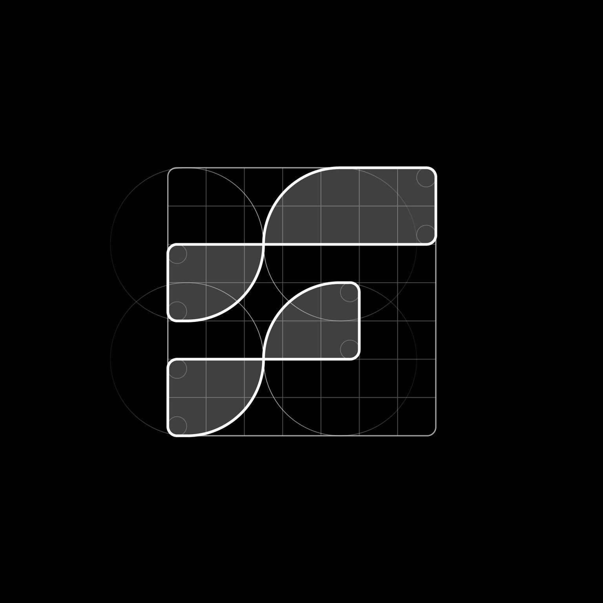

<div align="center">
  
  <h1>The Flow</h1>
  <p>
    <a href="https://tflow.dev">
      
    </a>
    <a href="https://x.com/tflow">
      
    </a>
  </p>
  <br>
</div>

# The Flow: AI Framework for Solana

A revolutionary low-code framework designed specifically for the Solana ecosystem, enabling developers to build, deploy, and scale AI models that seamlessly integrate with blockchain applications. From DeFi analytics to real-time transaction processing, The Flow brings the power of artificial intelligence to your Solana projects.

> "Bringing AI to Solana shouldn't require a Ph.D. in machine learning. The Flow makes it accessible to every blockchain developer."

## 🚀 Why The Flow?

The Flow bridges the gap between Solana's high-performance blockchain and advanced AI capabilities. Built with Solana's unique characteristics in mind, it offers:

### 🔗 Blockchain-Optimized AI

#### High-Performance Processing
- Parallel processing matching Solana's 65k TPS
- Multi-GPU support for distributed training
- 4-bit quantization for efficient model deployment
- Adaptive batch processing for optimal throughput
- Custom CUDA kernels for blockchain operations
- Dynamic scaling based on network load

#### Blockchain Integration
- Direct integration with Solana programs via REST API
- Real-time transaction analysis and pattern detection
- Hybrid on-chain/off-chain intelligence systems
- Native support for Solana data structures
- Automatic account data parsing and processing
- Websocket support for real-time updates

#### DeFi Analytics Suite
- Advanced time series forecasting for market prediction
- Multi-layer anomaly detection for risk assessment
- Cross-chain data correlation analysis
- Sentiment analysis of social signals
- Liquidity pool optimization
- Automated trading strategy validation

### 💻 Development Experience

#### Low-Code Architecture
- Intuitive YAML-based configuration
- Modular component system
- Inspired by Anchor's declarative approach
- Visual model builder interface
- Extensive template library
- Custom component creation support

#### Performance Optimization
- Automatic model optimization
- Smart GPU memory management
- Distributed training coordination
- Profile-guided optimization
- Memory-mapped model storage
- Adaptive batch sizing

#### Production Ready
- Zero-downtime deployment pipeline
- Comprehensive monitoring suite
  - Tensorboard integration
  - Custom metric tracking
  - Alert system
- Horizontal scaling support
- Automatic failover
- Load balancing

## 🏃‍♂️ Quick Start

### Installation

```bash
# Basic installation
pip install the-flow

# Full installation with all features
pip install the-flow[full]

# Solana-specific installation
pip install the-flow[solana]
```

### Environment Setup

```bash
# Set up your Solana environment
export SOLANA_RPC_URL="https://api.mainnet-beta.solana.com"
export SOLANA_WS_URL="wss://api.mainnet-beta.solana.com"

# Optional: Configure GPU settings
export CUDA_VISIBLE_DEVICES="0,1,2,3"
export THE_FLOW_MEMORY_FRACTION=0.8
```

## 📋 Requirements

### Software Requirements
- Python 3.8+
- CUDA Toolkit 11.0+
- Node.js 14+ (for web interface)
- Docker 20.10+ (optional)

### Hardware Recommendations
- CUDA-compatible GPU (minimum 8GB VRAM)
- 32GB+ System RAM
- 100GB+ SSD Storage
- High-speed Internet connection

### Optional Components
- Kubernetes cluster for distributed training
- TPU access for accelerated training
- Redis for caching and message queuing

## 🤝 Contributing

We welcome contributions from the community! Please see our [Contributing Guide](CONTRIBUTING.md) for detailed information.

## 📜 License

Apache 2.0 - See [LICENSE](LICENSE) for details.

## 🌟 Community

- [X](https://x.com/tflow) - Follow for updates
